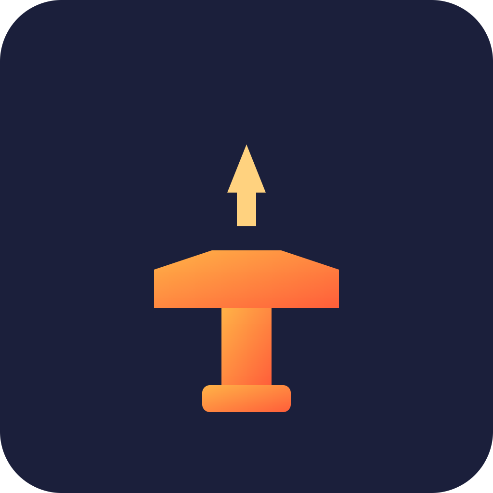

# GuildForge


On-chain reputation and auto-payout tool for gaming and DAO guilds

## Overview

GuildForge lets gaming guilds, DAOs, and hackathon teams track member contributions and automatically split on-chain rewards based on verifiable on-chain activity. It replaces spreadsheets and manual trust with transparent smart contracts and soulbound reputation NFTs.

## Problem

Teams and guilds struggle to fairly and transparently split rewards based on actual contribution. Most rely on manual trust, chat logs, or spreadsheets, which leads to disputes, slow payouts, and unverifiable claims about who did what.

## Solution

GuildForge issues soulbound reputation tokens for logged contributions and uses a Solana program to automatically split incoming funds (SOL/USDC) proportionally among guild members, based on their verifiable on-chain contribution history.

## Features (MVP)

- Create a guild and invite members with wallet addresses
- Log contributions (tasks, commits, matches won) on-chain
- Soulbound NFT reputation badges per contribution type
- Automated proportional payout splitting via Solana program
- Public guild profile page showing reputation and history

## Tech Stack

- Anchor (Solana smart contract framework)
- Metaplex (soulbound NFT badges)
- Solana Program Library
- Next.js (frontend)
- Supabase (off-chain indexing/metadata)
- Phantom Wallet Adapter

## How It Works

```
[Guild Member] --logs contribution--> [Anchor Program]
                                           |
                                           v
                                 [Mint Soulbound NFT Badge]
                                           |
                                           v
                              [Reputation Weight Updated]

[Incoming Reward (SOL/USDC)] --> [Solana Payout Program]
                                           |
                                           v
                         [Auto-split to Members by Reputation Weight]
```

Contributions are logged on-chain through an Anchor program, which triggers a Metaplex soulbound NFT mint as proof of that contribution. Reputation weight is derived from accumulated badges. When funds are sent to the guild's on-chain treasury, the Solana payout program distributes them proportionally based on each member's current reputation weight. Supabase and Next.js power the public guild profile page, reading on-chain state for display.

## Roadmap

- Integrate with Discord/game APIs for automatic contribution tracking
- Add dispute resolution via community voting
- Expand to cross-guild reputation portability

## Pitch

- [Pitch deck (PDF)](docs/pitch.pdf)
- [Pitch script](docs/pitch-script.md)

## Team

- Name / role — [GitHub](#) / [Twitter](#)
- Name / role — [GitHub](#) / [Twitter](#)
- Name / role — [GitHub](#) / [Twitter](#)

---

🎬 Pitch video: [docs/pitch-video.mp4](docs/pitch-video.mp4)


## Prototype

Live prototype: https://daisuke5050-pixel.github.io/guildforge/

The source is [docs/index.html](docs/index.html) (served with GitHub Pages from the /docs folder). All data is simulated.
